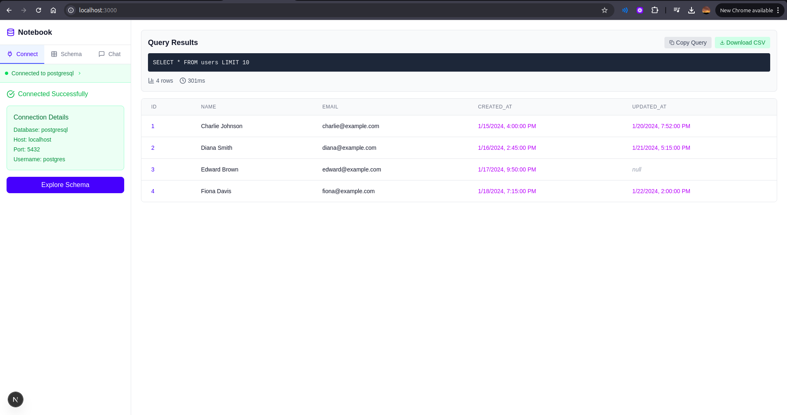

# Notebook - Database Explorer

A modern, interactive database exploration tool built with Next.js and React. Think of it as your friendly neighborhood database browser with a chat interface that actually makes sense.

## What This Thing Does

Notebook lets you connect to your databases (PostgreSQL and MySQL for now), browse through your schema like you're window shopping, and chat with an AI assistant about your data. It's like having a database expert sitting next to you, except they don't drink your coffee.

## Getting Started

### Prerequisites

- Node.js (18 or higher - because life's too short for old Node versions)
- A database you want to explore (PostgreSQL or MySQL)
- Basic knowledge of what a database is (we won't judge if you're still figuring it out)

### Installation

1. Clone this repository:
```bash
git clone https://github.com/meMehtab/notebook_sidebar_workflow.git
cd notebook_sidebar_workflow
```

2. Install dependencies:
```bash
npm install
```

3. Start the development server:
```bash
npm run dev
```

4. Open your browser and navigate to `http://localhost:3000`

That's it! No complex configuration files, no mysterious environment variables, just pure simplicity.

## How to Use

1. **Connect**: Fill in your database credentials in the Connect tab. Don't worry, we're not storing your passwords anywhere sketchy.

2. **Explore**: Once connected, hit the Schema tab to browse your tables. Click on any table name to see its columns, or hit "Preview" to see some actual data.

3. **Chat**: Got questions about your database? Head to the Chat tab and ask away. The AI assistant knows about your schema and can help you understand your data structure.

## Recording
- **Screen Recording**:  Find the link to screen recording below to see app in action:
[Click here to see screen recording](https://www.loom.com/share/4940ba7772bb4eb0b9956a797b831f61?sid=d7134f3b-ddc1-4468-a093-fc85ef660487) 

## Assumptions I Made

- **Mock Everything**: This is a prototype, so instead of actually connecting to real databases, everything is mocked. The connection form will accept any password and show you a fake schema. It's like a database simulator, but more honest about it.

- **Limited Query Support**: Right now, the system only handles basic SELECT queries with LIMIT clauses. No DELETE, UPDATE, or anything.

- **PostgreSQL/MySQL Only**: I focused on these two because they're the most common. Adding more database types would be straightforward, but let's walk before we run.

- **No Authentication**: This is a local development tool. In a real-world scenario, you'd want proper authentication, user management, and probably some security that doesn't make security experts cry.

- **Client-Side Only**: Everything happens in the browser. No server-side database connections, no API keys to manage, no infrastructure to worry about.

## Known Issues & Limitations

### The "It Works On My Machine" Section

- **Mock Data Only**: The database connection is completely fake. It will show you a predefined schema regardless of what credentials you enter. Perfect for demos, less perfect for actual work.

- **No Real Query Execution**: When you preview tables, you're seeing mock data. The query runner simulates execution but doesn't actually hit a database.

- **Limited Error Handling**: Error messages are basic. In a real app, you'd want more detailed error reporting and recovery options.

- **No Data Persistence**: Refresh the page and everything resets. No localStorage, no session management, just a clean slate every time.

### The "I Knew That Was Going To Be A Problem" Section

- **Responsive Design**: The layout works best on desktop. Mobile users might have to squint a bit.

- **Performance**: Large schemas (hundreds of tables) might make the interface sluggish. The search helps, but there's room for optimization.

## Screenshots




## Future Enhancements

### The "When I Have More Time" List

- **Real Database Connections**: Implement actual database connectivity with proper connection pooling and security.

- **Advanced Query Builder**: Visual query builder for non-SQL folks. Drag, drop, and query without typing.

- **Schema Visualization**: Interactive diagrams showing table relationships and foreign keys.

- **Query History**: Save and reuse your favorite queries.

- **Collaborative Features**: Share queries and results with your team.

## Technical Details

### Stack

- **Next.js 15**: Because it's fast and makes React development actually enjoyable
- **React 19**: The latest and greatest
- **TypeScript**: For when you want to catch bugs before they become "features"
- **Tailwind CSS**: Utility-first CSS that doesn't make you want to throw your laptop
- **Lucide React**: Beautiful icons that don't require a PhD in SVG
